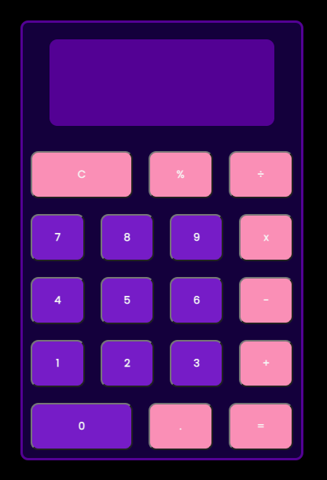

# JavaScript Calculator 

### Description 
Calculator built using HTML, JavaSscript and SASS. The calculator is able to perform the following opperations: addition, subtraction, division and multiplcation. It also have a percentage function and can handle decimals. 

### Table of contents
    MVP
    Links
    Questions 
    
### MVP
Requirements: 
• Accept a minimum of 2 inputs, perform an operation and return the output.
• Contain number keys 0-9.
• Contain operator keys (+, -, *, /).
• Should handle decimals.

### Links
Link to the calculator

### Questions section 