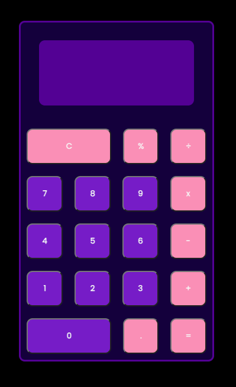

# **JavaScript Calculator**
***

### **Description**
Calculator built using JavaScript, HTML, CSS, SCSS and BEM. This is a simple calculator that is able to perform addition, subtraction, division and multiplication. It also has a percentage function and can handle decimals.   

---
| **Table of contents** |
|---|
| Technology |
| Design |
| Functionality |
| Images |
| Links |

### **Technology**
*   JavaScript
*   HTML
*   CSS
*   SCSS
*   BEM
*   GitHub

### **Design**
*   Designed using figma
*   Built using a mobile first approach
*   Modelled on an android phone calculator
*   Responsive to device size

### **Functionality**
* Performing an equation - for addition, subtraction, division and multiplication you need two inputs. Whereas the percentage button can be used on a single input.
* Multiple sums - when you add an additional operator the current sum will be calculated. The display will show the total for the previous sum and add the new operator in the display.
* Clear button - if clicked once it will delete the last character, if clicked twice it will clear the display.
* Input - numbers are limited to 14.

### **Images**

### **Links**
[GitHub repository](https://github.com/OBuckland/js-calculator "GitHub")

[Figma design](https://www.figma.com/file/EeIKn05uzHS8RvLBAlEMRx/js-calculator "Figma")

[The Calculator](http://127.0.0.1:5501/index.html "Link to Calculator")